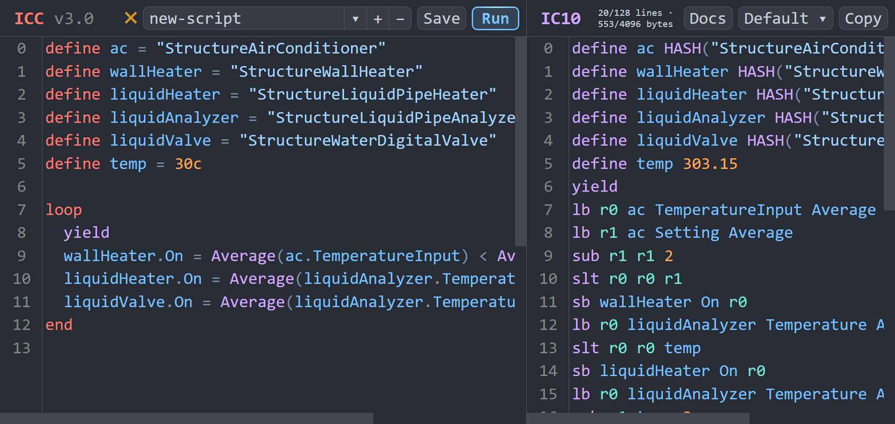

# Stationeers-ICC
ICC is a small custom programming language that compiles to [IC10](https://stationeers-wiki.com/IC10), the scripting language used in [Stationeers](https://store.steampowered.com/app/544550/Stationeers/).

This tool was made to *enhance* the experience of writing IC10 by providing a powerful, yet intuitive syntax to support the development of complex programs. Several optimizations were put in place to keep programs compact so that you don't need to worry about the compiler generating unoptimized code.

This programming language is different from most other languages in that it was designed *explicitly* for IC10. This syntax might feel familiar for those who have written IC10 in the past. In fact, you can use all of the available IC10 instructions just by calling them as a function!

To get started, visit the [documentation page](https://emmennater.github.io/IC10-Compiler/docs.html) to learn more about ICC. Once you are ready, try writing your first program in the [editor](https://emmennater.github.io/IC10-Compiler/index.html). Find a bug? Leave an issue and I'll look into it!