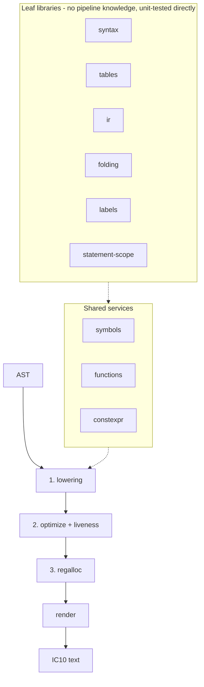

# IC10 Compiler

A compiler from a small high-level language to **IC10** assembly (the
Stationeers in-game chip language), refactored from a single 2,733-line
closure into a set of small libraries. The public API is unchanged:
`compile(ast, config?)`, `CompileError`, and `SyntaxNode` are exported from
`index.ts`.

```ts
import { getAST } from "./ast.ts";
import { compile } from "./index.ts";
const ic10 = compile(getAST(source), { removeLabels: false });
```

## Operators

| Operator | IC10 | Notes |
| --- | --- | --- |
| `+` `-` `*` `/` `%` | `add` `sub` `mul` `div` `mod` | `%` is a true modulo: the result takes the divisor's sign |
| `==` `!=` `<` `<=` `>` `>=` | `seq` `sne` `slt` `sle` `sgt` `sge` | fuse into a branch when used as a condition |
| `&&` `\|\|` `!` | `and` `or` `seqz` | logical: each side is coerced to an exact 0/1 first |
| `&` `\|` `^` `~` | `and` `or` `xor` `not` | bitwise, over the 64-bit two's complement word |
| `<<` `>>` `>>>` | `sll` `sra` `srl` | `>>` keeps the sign bit, `>>>` shifts zeroes into it |

Every binary operator has a compound form (`&=`, `<<=`, `>>>=`, …).
Precedence follows C, so `a & 1 == 1` is `a & (1 == 1)`; parenthesize when
that is not what you meant.

The bitwise operators truncate their operands toward zero and wrap at 64
bits, exactly as the chip does — so `5.9 & 3` is `1`, `~0` is `-1`, and
`1 << 40` is `1099511627776`, not the 256 that JavaScript's own 32-bit
operators would give. Compile-time folding goes through the same
implementation as codegen (`tables.ts`), so a folded result cannot disagree
with a computed one. `nor` and `sla` have no operator; call them directly
(`nor(a, b)`), which works for any opcode.

## Architecture

The design goal is that each file reads on its own. Leaf libraries know
nothing about the compiler; the three pipeline phases are composed in a
15-line `compile()`.



| Module | Responsibility |
| --- | --- |
| `ast.ts` | The real parser: `getAST(text)` over the generated Lezer parser; defines `SyntaxNode`/`CompileError` |
| `syntax.ts` | `ErrorReporter` and all AST navigation (re-exports `SyntaxNode`/`CompileError` from `ast.ts`) |
| `tables.ts` | Opcode tables and the one shared implementation of IC10 arithmetic/bitwise/comparison semantics |
| `ir.ts` | Operands, the `Inst` union, id allocation, pure accessors, `assertNever` |
| `folding.ts` | Constant folding and Sethi–Ullman pressure estimation - pure functions over the tree |
| `labels.ts` | Every generated label name |
| `statement-scope.ts` | Placeholder-read cache + vreg watermark, kept together as one invariant |
| `symbols.ts` | `ScopeChain`, an immutable scope value with the function-visibility rule |
| `functions.ts` | User-function metadata and syntactic read/write-set analyses |
| `constexpr.ts` | Compile-time interpreter for `@constexpr` functions |
| `lowering.ts` | Phase 1: `Lowerer` (registries, assembly) + `FrameLowerer` (one instance per lexical frame) |
| `liveness.ts` | Iterative backward liveness to a fixed point, shared by DCE and allocation |
| `optimize.ts` | Phase 2: dead code elimination alternating with control-flow cleanups |
| `regalloc.ts` | Phase 3: linear-scan allocation, store hoisting, stack spilling |
| `render.ts` | IC10 text emission and optional label-to-line resolution |
| `index.ts` | Public API, config validation, phase orchestration |

### On mutable state: frames, not save/restore

Lowering is built from **frames**. A `FrameContext` is an immutable value -
the buffer to emit into, the visible `ScopeChain`, where `return` and
`break` go, which functions are mid-lowering - and entering a function body,
block, loop, or inlined parameter's caller scope constructs a *new*
`FrameLowerer` over a derived context. Leaving is simply returning from the
call: the caller's frame was never modified, so there is nothing to save
and nothing to restore. The JavaScript call stack is the only stack.

- `ScopeChain` is a value: `child()` and `functionFrame()` derive new
  chains, and capturing the caller's scopes for an inlined parameter is
  just keeping the chain you already have.
- A frame physically cannot reach another frame's buffer - the bug class
  behind two of the original's seven defects is unrepresentable.
- Folding and pressure estimation are pure functions taking a one-method
  callback, so they can be exercised with a stub and a hand-built node.
- The only remaining "save/restore" is the phi-avoidance algorithm itself
  (demotion and `globalViews`), which snapshots *variable knowledge* along
  control-flow paths - modeling the compiled program, not compiler
  context.

## Behavioral fixes vs the original

Everything else is byte-identical. The numbering below is the project's
stable reference for these fixes (see also CLAUDE.md, which carries the same
numbering plus fix 8, an added optimization).

1. **`%` constant-folded as division** - `define m = 7 % 3` produced `2.333…`.
2. **If-regions inside jal-lowered functions** were invisible to branch
   simplification (missed optimization, not a miscompile).
3. **Repeat-until back jump** - the same emit-buffer mix-up.
4. **Label resolution** replaced any token matching a label name on any line.
   Silent miscompile: with a function `scale` and a placeholder also named
   `scale`, the read `move r0 scale` became `move r0 1`.
5. **While-condition folded with stale constants** - `let i = 0;
   while i < 10 do i += 1` compiled to an infinite loop with no exit branch.
6. **Spilling a value one instruction both reads and writes** - `i += 1`
   lowers to `add home home 1`; the use was never reloaded, so the counter
   was backed by a second, never-written stack slot and read garbage every
   iteration.
7. **`break`/`continue` inside a jal-lowered function body** jumped across
   the function boundary into whichever caller loop enclosed the call site
   that happened to trigger lowering, `ra` still pending. Now an error;
   inlined bodies keep the caller's loop on purpose (macro semantics).

Each fix is pinned by a differential case flagged `expectOriginalDiff`, so
the harness distinguishes it from a regression. Because the original
disagrees with those cases by design, each also pins its full output with an
`expected` golden - the runner requires one on every flagged case.

## Verification

```sh
npm install
npm run typecheck   # tsc --noEmit, strict + noUnusedLocals/Parameters + noFallthroughCasesInSwitch
npm test            # vitest: units + differential + language-case suites
npm run dev          # vite dev server for the manual test-string page (index.html/main.js)
```

`npm test` runs four suites:

1. **122 unit tests** (`tests/units.test.ts`) over the leaf libraries - no
   AST, no `compile()`.
2. **41 differential cases** (`tests/cases.test.ts`), each source program
   compiled through both the pristine original and the refactor, covering
   folding, ifs, all three loop kinds, break/continue, inline and jal
   functions, non-leaf functions (`push ra`/`pop ra`), constexpr evaluation
   and bail-out, aggregators, define chains, aliases, slot ops, spilling
   under 2- and 3-register orders, label resolution and name collision, and
   error paths. Asserts refactor ≡ pristine original byte-for-byte except on
   cases flagged `expectOriginalDiff`, which instead pin their full output
   with `expected`, and that expected substrings appear.
3. **Language-level regression cases** (`tests/language-cases.test.mjs`,
   wrapping `tests/test.mjs`) - real source strings through the actual
   parser (`ast.ts` + `lezer/lang.grammar`) and `compile()`, asserting exact
   output or error message. Also runnable standalone: `node tests/test.mjs`.
4. **38 formal-AST cases** (`tests/formal-ast.test.ts`) - source strings
   through `getAST` → `getFormalAST`, asserting the typed tree's shape. It
   touches no part of the compile pipeline.

r16 (sp) and r17 (ra) are reserved for stack and function support.
